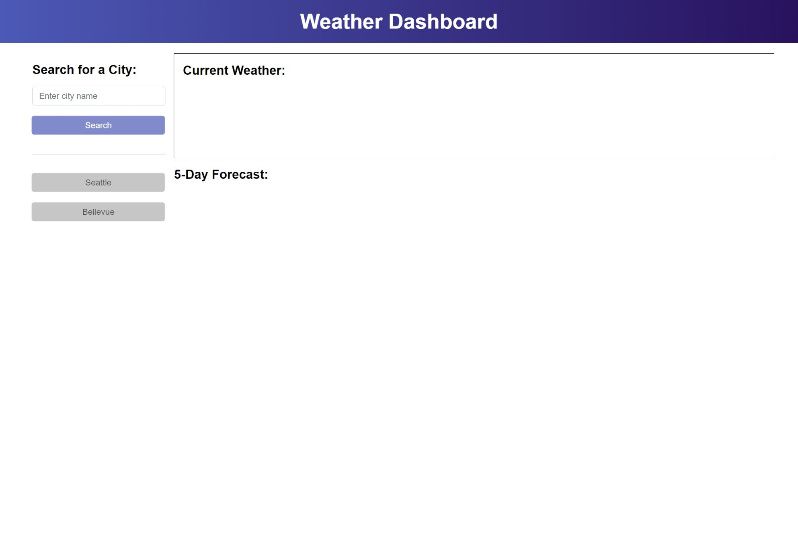

<!-- omit in toc -->
# Weather Dashboard

<!-- omit in toc -->
## Description

This is a simple weather dashboard app that retrieves weather data for cities from third-party API, OpenWeatherMap. When user searches a city, the dashboard will display both current weather and the weather forecast of the next 5 days. The search history is automatically saved in local storage and displayed as a button with each city name under the search bar, and when the button is clicked, user is again presented with current and future conditions ofr that city.
 
 
You can check out the deployed application from the link below:
 
[https://clairehwcho.github.io/weather-dashboard/](https://clairehwcho.github.io/weather-dashboard/)

<!-- omit in toc -->
## Table of Contents
- [Installation](#installation)
- [Screenshots](#screenshots)
- [License](#license)

## Installation

No special requirements.

## Screenshots

- Index page

## License
Copyright © 2022 [Claire Cho](https://github.com/clairehwcho).